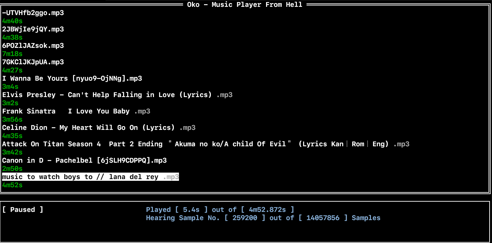

# Oko - Music Player From Hell
### 

## How to use 

If not having already create a `config.json` file in the directory `.config/oko`
it should look like this.

`
{
    "folders": [], 
    "yt-dlp-path": "", 
    "yt-api-key": "" 
}
`

add the folder's absolute path in the array. That's it restart the app.  
